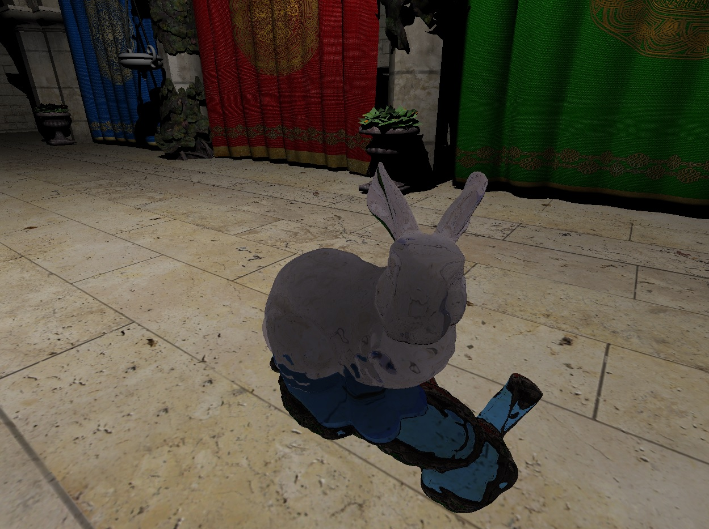

# FrameGraph Samples

## Ray tracing
Experiments with ray tracing extension.
- [x] Order independent transparency
- [x] Refraction
- [ ] Reflection
- [ ] PBR

used glTF Sponza from https://github.com/KhronosGroup/glTF-Sample-Models/tree/master/2.0/Sponza

## Planet rendering
- [x] Identity projection
- [x] Tangential projection
- [x] Displacement mapping
- [ ] Atmosphere rendering
- [ ] Procedural textures
- [ ] Dynamic LODs

## Shadertoy
Some shaders from [Shadertoy](https://www.shadertoy.com).
- [x] Manual camera
- [x] VR
- [x] Offline renderer

## Vulkan samples
Here are some prototypes of new features written on a pure Vulkan API before they are added to FrameGraph.
* Async compute
* Performace tests: Clear image, Generate mipmaps
* Ray tracing extension (Nvidia only)
* Sparse image
* Shading rate image extension (RTX only)
* Mesh shader extension (RTX only)
* Image footpring extension (RTX only)
* Fragment shader barycentric extension (RTX only)
